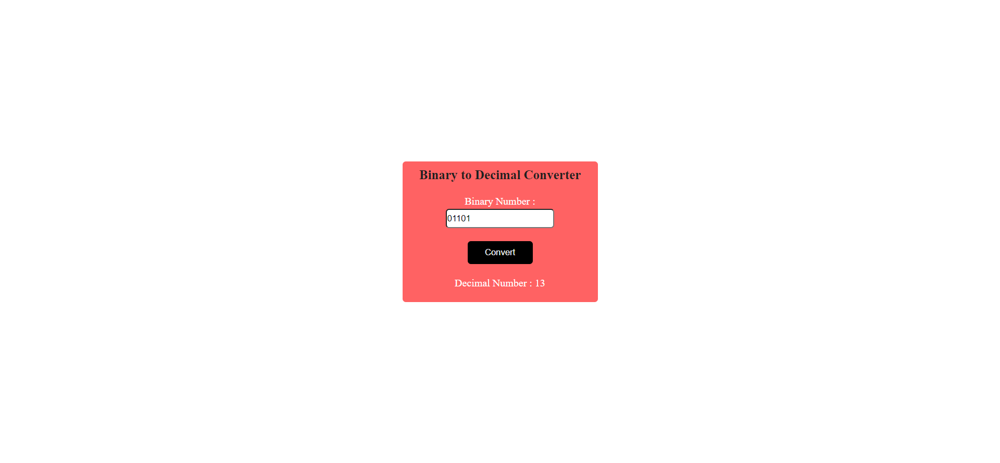

<!-- Intro -->
# All About JavaScript

<!-- Social Links -->
[![LinkedIn][linkedin-shield]][linkedin-url]
[![Instagram][instagram-shield]][instagram-url]
[![Twitter][twitter-shield]][twitter-url]
[![Hashnode][hashnode-shield]][hashnode-url]

<!-- PROJECT LOGO -->
 

  

<h3 align="center">Convert Binary to Decimal</h3>

  
   
    <a href="https://vb-binary-to-decimal.vercel.app/">View Live Demo</a>
  

<!-- ABOUT THE PROJECT -->

## About The Project

Here's a Screen-Shot of my project and I learnt Most of my usefull Future of JavaScript.
 
 

## Built With

**Using Technologies**

1. HTML
2. CSS
3. JavaScript

 

## Live Project

This project is presently deployed in **Vercel Service**.

[Live Project URL](https://vb-binary-to-decimal.vercel.app/)
 

<!-- LEARNT -->
 

## Learnt
In This project i learnt more about JavaScript And much more.
- JavaScript

<!-- NOTE -->
 

## Time

For this project i took around `10 to 15 minutes` to complete it.
 

<!-- CONTACT -->

## Contact

- **Name 👨‍💻:** [Vandit Bera](https://github.com/vandit-bera)
- **Email 📧:** [vanditbera@gmail.com](mailto:vanditbera@gmail.com)
- **Blog 📝:** [blogs.Vandit2510.in](https://vandit-bera.hashnode.dev/)

Project Link: [GitHub](https://github.com/vandit-bera/Binary-To-Decimal)

<!-- Linkedin -->

[linkedin-shield]: https://img.shields.io/badge/-LinkedIn-black.svg?style=for-the-badge&logo=linkedin&colorB=0B5FBB
[linkedin-url]: https://www.linkedin.com/in/vandit-bera-4a0b02221/

<!-- Instagram -->

[instagram-shield]: https://img.shields.io/badge/Instagram-%23E4405F.svg?style=for-the-badge&logo=Instagram&logoColor=white
[instagram-url]: https://instagram.com/vandit.bera

<!-- Twitter -->

[twitter-shield]: https://img.shields.io/badge/Twitter-%231DA1F2.svg?style=for-the-badge&logo=Twitter&logoColor=white
[twitter-url]: https://twitter.com/vandit_bera_

<!-- Hashnode -->

[hashnode-shield]: https://img.shields.io/badge/Hashnode-2962FF?style=for-the-badge&logo=hashnode&logoColor=white
[hashnode-url]: https://vandit-bera.hashnode.dev/
